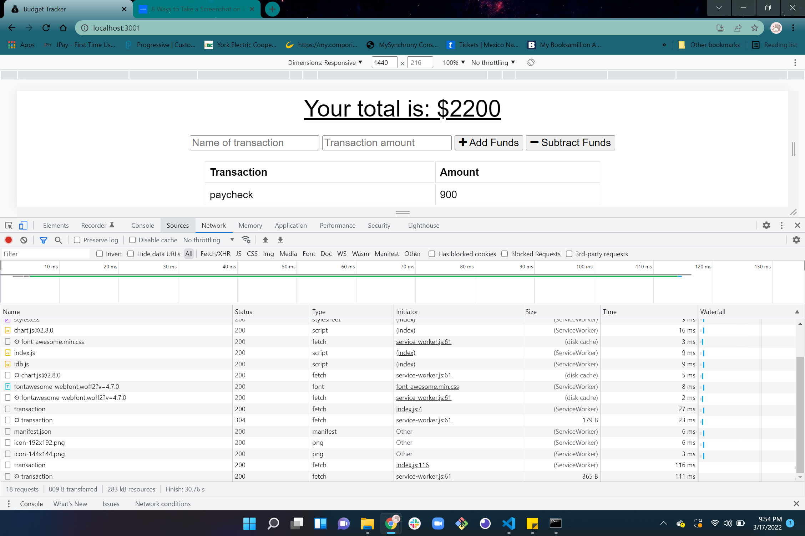
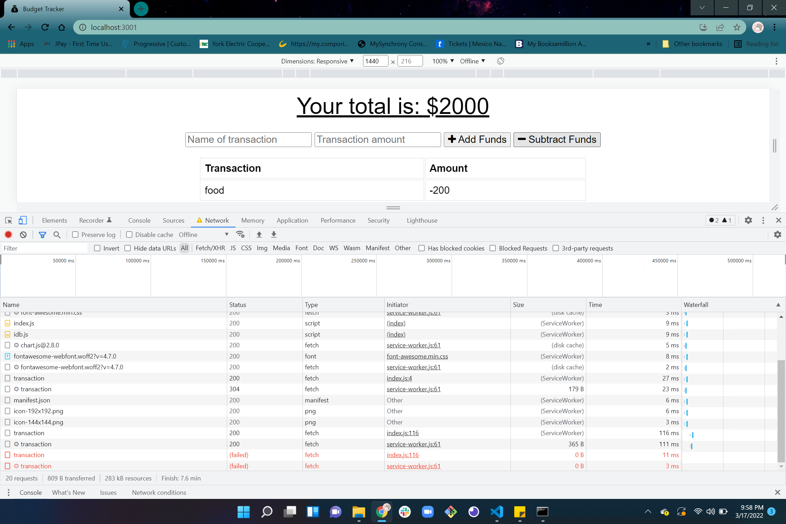
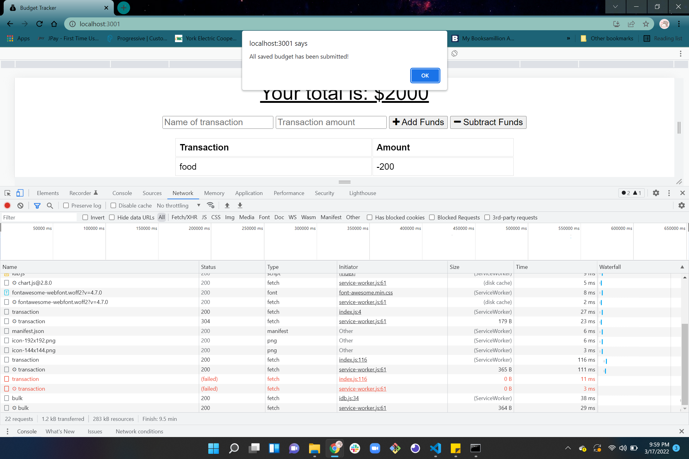

# Budget Tracker Starter Code

# Description
For this week challenge, We are given an budget tracker starter code. The app must allow for offline access and functionality. The user will be able to add expenses and deposits to their budget with or without a connection. If the user enters transactions offline, the total should be updated when they're brought back online.<br>
<br>


### ONLINE:

### OFFLINE:

### BACK-ONLINE:


# Table of contents
[Installation](#Installation)<br>
[Usage](#Usage)<br>
[User Story](#User-Story)<br>
[Acceptance Criteria](#Acceptance-Criteria)<br>
[Credits](#Credits)<br>


# Installation
```
npm init -y
```

# Usage
Execute the script as follows:
```
npm start 
```
### Application include:
- Service Worker - is a JavaScript file used to cache certain assets of your application. It works by allowing a developer to control how network requests are handled by the app.<br>
- Web Manifest - with the app’s metadata, to let users’ devices know what they’re installing and how the app should look on the home screen.

This `manifest.json` file for this project will contain the following properties:

`name`

`short_name`

`icons`

`theme_color`

`background_color`

`start_url`

`display`<br>
- IndexedDB for offline functionality :<br>

Once you’ve updated the existing budget tracker, it should provide the following functionality:

The ability to enter deposits offline.

The ability to enter expenses offline.

Offline entries should be added to the tracker when the application is brought back online.


# User Story
```
AS AN avid traveler
I WANT to be able to track my withdrawals and deposits with or without a data/internet connection
SO THAT my account balance is accurate when I am traveling 
```


# Acceptance Criteria
```
GIVEN a budget tracker without an internet connection
WHEN the user inputs an expense or deposit
THEN they will receive a notification that they have added an expense or deposit
WHEN the user reestablishes an internet connection
THEN the deposits or expenses added while they were offline are added to their transaction history and their totals are updated
```

# Credits

GitHub: https://github.com/maddi124<br>
Starter Code: https://github.com/coding-boot-camp/symmetrical-bassoon.git<br>